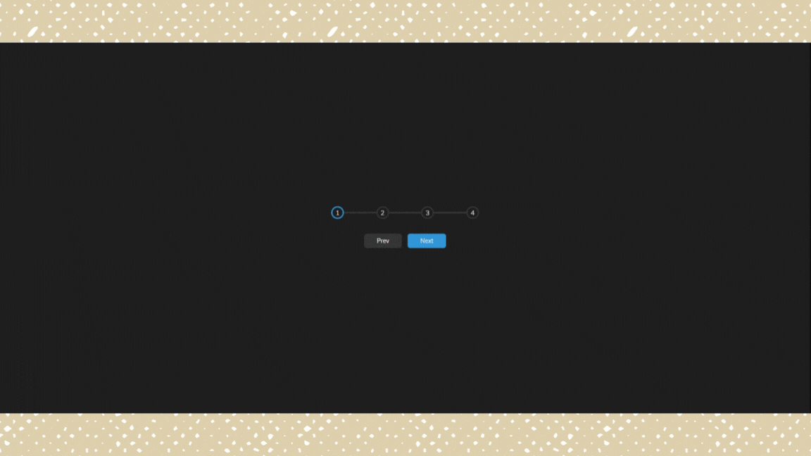
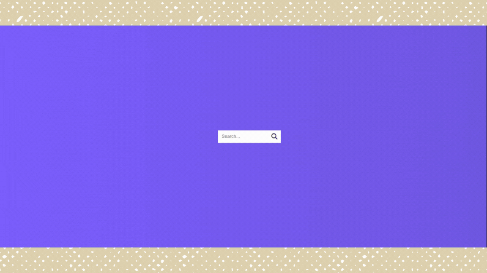
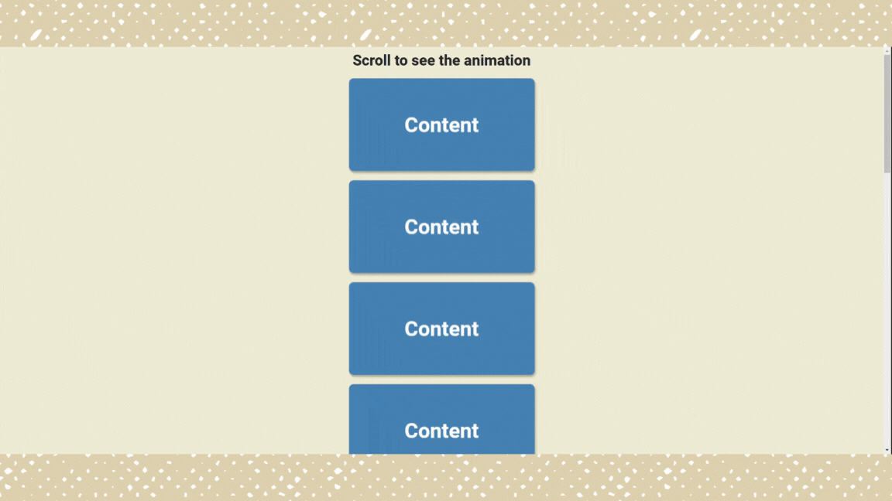
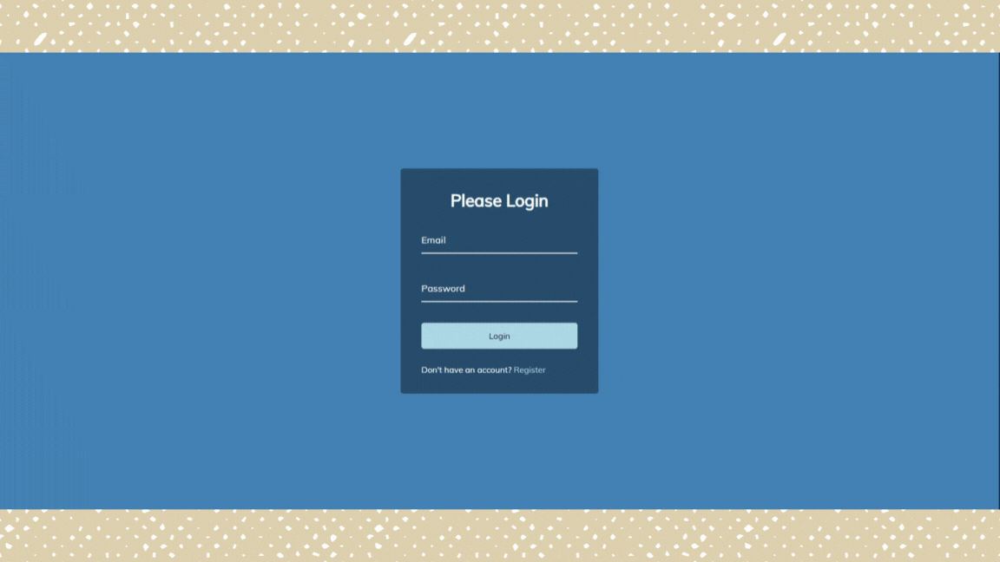
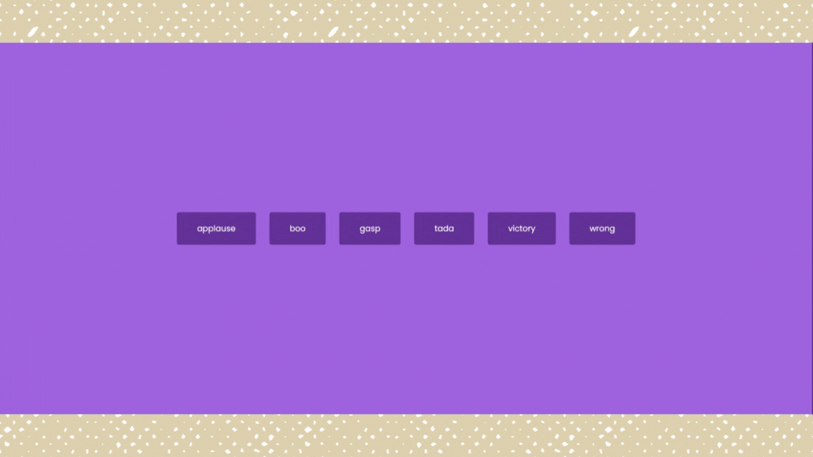

# html-css-js-only-projects

### 001-expanding-cards - [Code](https://github.com/irahuldutta02/html-css-js-only-projects/tree/main/001-expanding-cards/) | [Live](https://irahuldutta02.github.io/html-css-js-only-projects/001-expanding-cards/)

### 002-progress-steps - [Code](https://github.com/irahuldutta02/html-css-js-only-projects/tree/main/002-progress-steps/) | [Live](https://irahuldutta02.github.io/html-css-js-only-projects/002-progress-steps/)

### 003-rotating-navigation - [Code](https://github.com/irahuldutta02/html-css-js-only-projects/tree/main/003-rotating-navigation/) | [Live](https://irahuldutta02.github.io/html-css-js-only-projects/003-rotating-navigation/)

### 004-hidden-search-widget - [Code](https://github.com/irahuldutta02/html-css-js-only-projects/tree/main/004-hidden-search-widget/) | [Live](https://irahuldutta02.github.io/html-css-js-only-projects/004-hidden-search-widget/)

### 005-blurry-loading - [Code](https://github.com/irahuldutta02/html-css-js-only-projects/tree/main/005-blurry-loading/) | [Live](https://irahuldutta02.github.io/html-css-js-only-projects/005-blurry-loading/)

### 006-scroll-animation - [Code](https://github.com/irahuldutta02/html-css-js-only-projects/tree/main/006-scroll-animation/) | [Live](https://irahuldutta02.github.io/html-css-js-only-projects/006-scroll-animation/)

### 007-split-landing-page - [Code](https://github.com/irahuldutta02/html-css-js-only-projects/tree/main/007-split-landing-page/) | [Live](https://irahuldutta02.github.io/html-css-js-only-projects/007-split-landing-page/)

### 008-form-wave-animation - [Code](https://github.com/irahuldutta02/html-css-js-only-projects/tree/main/008-form-wave-animation/) | [Live](https://irahuldutta02.github.io/html-css-js-only-projects/008-form-wave-animation/)

### 009-sound-board - [Code](https://github.com/irahuldutta02/html-css-js-only-projects/tree/main/009-sound-board/) | [Live](https://irahuldutta02.github.io/html-css-js-only-projects/009-sound-board/)
